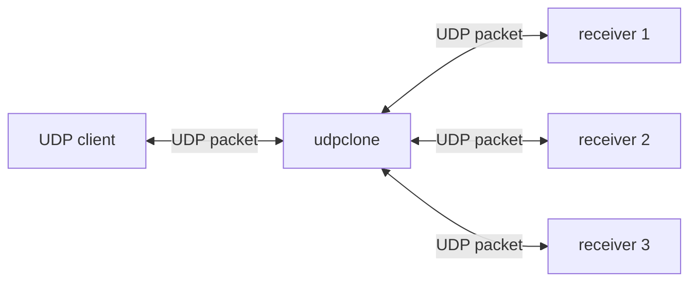
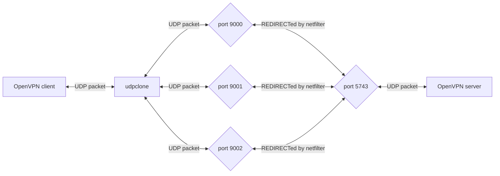

# About
[](http://creativecommons.org/publicdomain/zero/1.0/)


`udpclone` just copies a packet and sends it to as may destinations as needed, and it sends back any traffic that was received from any of these destinations.



Personally I used it for OpenVPN:

where each connection used different channel via iproute2 rules. OpenVPN drops duplicated packets by itself as part of anti-replay protections.

This helped to mitigate really poor connection of one of my mobile streaming (SRT) setups, that uses 3 SIM cards. I guess I could've duplicated the traffic of SRT itself instead of OpenVPN, but I also wanted to have SSH and other connections work reliably.

# Howto

### Build
```sh
git clone https://github.com/xaionaro-go/udpclone /opt/udpclone
cd /opt/udpclone
go build
ln -s ../../../opt/udpclone /usr/local/bin
```

### Run
Configure buffers:
```sh
# increase the buffer, otherwise we get error "No buffer space available"
echo $[ 64 * 1024 * 1024 ] > /proc/sys/net/core/wmem_max
```

Run `udpclone`:
```sh
udpclone --listen-addr 0.0.0.0:9000 --destinations X.X.X.X:9000,Y.Y.Y.Y:9000,Z.Z.Z.Z:9000
```

# Example
### The OpenVPN example from "About":

Client-side configuration:
```sh
echo $[ 64 * 1024 * 1024 ] > /proc/sys/net/core/wmem_max # otherwise we get error "No buffer space available"

ip rule add ipproto udp dport 9000 lookup wlan0  pref 4000
ip rule add ipproto udp dport 9001 lookup rmnet1 pref 4010
ip rule add ipproto udp dport 9002 lookup bt-pan pref 4020
```

`udpclone` (launched on the client side):
```
udpclone --listen-addr 0.0.0.0:5743 --destinations my.home.address:9000,my.home.address:9001,my.home.address:9002
```

In my case `my.home.address` was a DyDNS-address.


Server-side configuration:
```sh
nft add rule nat PREROUTING iif lxc udp dport 9000-9010 ip daddr X.X.X.X dnat X.X.X.X:5743
```

# Similar projects (and the difference)
*(feel free to make a PR adding your project here...)*
* https://github.com/chenx-dust/paracat. deduplicates traffic automatically, by adding a sequence number to packets and then stripping it back. Supports also Round-Robin mode. *But it does not support the case if one of the destinations not available in the beginning or the case of changing the destination IP (a-la DyDNS destinations).*
* https://github.com/path-network/UDP-Clone. A minimalistic tool that does essentially the same as `udpclone`. *But it does not support the case if one of the destinations not available in the beginning or the case of changing the destination IP (a-la DyDNS destinations).*
